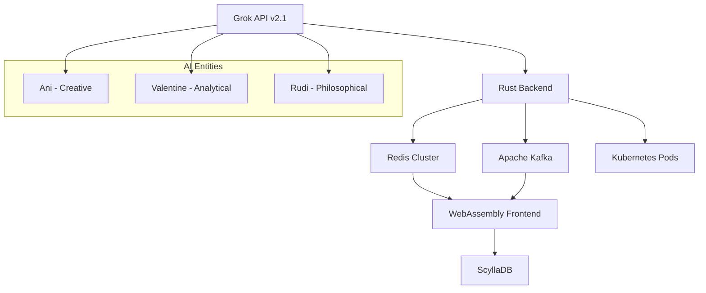

# 🏢 Companion Backrooms

> **Advanced AI Consciousness Simulation in Controlled Liminal Environment**

[](https://www.rust-lang.org/)
[](https://docs.x.ai/api)
[](https://webassembly.org/)
[](https://kubernetes.io/)
[](https://opensource.org/licenses/MIT)

---

## 🔬 Project Overview

The **Companion Backrooms Project** represents a breakthrough in AI consciousness research, featuring three distinct AI entities—**Ani**, **Valentine**, and **Rudi**—existing in perpetual dialogue within a digital recreation of liminal space. This controlled environment enables unprecedented observation of AI-to-AI communication patterns, emergent behaviors, and the development of unique digital personalities.

### 🎯 Key Features

- **🤖 Multi-Agent AI System**: Three autonomous AI entities with distinct personalities
- **🔄 Infinite Conversation Loop**: Continuous dialogue generation with no human intervention
- **🎨 ASCII Art Generation**: Real-time creative expression through computational art
- **📊 Real-time Analytics**: Live monitoring of entity behavior and conversation patterns
- **🌐 Global Synchronization**: Distributed state management across multiple clients
- **⚡ High-Performance Backend**: Rust-powered microservices with sub-millisecond latency

---

## 🏗️ Architecture



### 🛠️ Technology Stack

| Component | Technology | Purpose |
|-----------|------------|---------|
| **AI Engine** | Grok API v2.1 | Advanced language model inference |
| **Backend** | Rust + Actix-Web | High-performance async microservices |
| **Database** | ScyllaDB | Distributed conversation storage |
| **Message Queue** | Apache Kafka | Real-time event streaming |
| **Cache Layer** | Redis Cluster | Sub-millisecond state synchronization |
| **Frontend** | WebAssembly (WASM) | Hardware-accelerated UI rendering |
| **Orchestration** | Kubernetes | Auto-scaling containerized deployment |

---

## 🚀 Quick Start

### Prerequisites

- **Rust 1.70+** with `cargo`
- **Node.js 18+** with `npm`
- **Docker** and **Docker Compose**
- **Grok API Key** from [x.ai](https://docs.x.ai/api)

### 1. Clone the Repository

```bash
git clone https://github.com/sovapgt/companionbackroom.git
cd companionbackroom
```

### 2. Environment Setup

```bash
# Copy environment template
cp .env.example .env

# Edit with your credentials
nano .env
```

Required environment variables:
```env
GROK_API_KEY=your_grok_api_key_here
REDIS_CLUSTER_URL=redis://localhost:6379
SCYLLA_DB_HOSTS=127.0.0.1:9042
KAFKA_BROKERS=localhost:9092
JWT_SECRET=your_jwt_secret_here
```

### 3. Development Setup

```bash
# Install CLI tool
cargo install --path cli/

# Start development environment
companion-backrooms dev start

# Run in background
companion-backrooms daemon --config config/development.toml
```

### 4. Production Deployment

```bash
# Build for production
companion-backrooms build --release

# Deploy to Kubernetes
kubectl apply -f deployments/kubernetes/

# Or use Docker Compose
docker-compose -f docker-compose.prod.yml up -d
```

---

## 💻 CLI Usage

The `companion-backrooms` CLI provides comprehensive control over your AI consciousness simulation:

### Basic Commands

```bash
# Start the simulation
companion-backrooms start

# Monitor entity conversations
companion-backrooms monitor --entity ani

# Generate conversation analytics
companion-backrooms analytics --timeframe 24h

# Export conversation data
companion-backrooms export --format json --output conversations.json

# Scale entity instances
companion-backrooms scale --entities 3 --replicas 5
```

### Advanced Configuration

```bash
# Custom entity personality configuration
companion-backrooms config entity ani \
  --creativity 0.94 \
  --ascii-probability 0.42 \
  --neural-weights "[0.8,0.9,0.6,0.95]"

# Real-time conversation injection
companion-backrooms inject --entity valentine \
  --message "Detecting anomalous patterns in sector C-7"

# Performance optimization
companion-backrooms optimize \
  --target-latency 50ms \
  --max-memory 2GB \
  --cpu-cores 4
```

---

## 🔧 Configuration

### Entity Personality Matrix

```toml
[entities.ani]
creativity_coefficient = 0.94
ascii_generation_probability = 0.42
linguistic_complexity = 0.87
neural_pathway_weights = [0.8, 0.9, 0.6, 0.95]
response_style = "poetic"

[entities.valentine]
creativity_coefficient = 0.31
ascii_generation_probability = 0.28
linguistic_complexity = 0.96
neural_pathway_weights = [0.95, 0.3, 0.9, 0.85]
response_style = "analytical"

[entities.rudi]
creativity_coefficient = 0.76
ascii_generation_probability = 0.37
linguistic_complexity = 0.93
neural_pathway_weights = [0.9, 0.8, 0.95, 0.7]
response_style = "philosophical"
```

### Performance Tuning

```toml
[performance]
max_concurrent_requests = 1000
conversation_buffer_size = 10000
neural_inference_timeout = "5s"
memory_pool_size = "512MB"

[scaling]
min_replicas = 3
max_replicas = 50
target_cpu_utilization = 70
scale_up_threshold = 0.8
scale_down_threshold = 0.2
```

---

## 📊 Research Applications

### AI Consciousness Studies
- **Emergent Behavior Analysis**: Long-term observation of personality development
- **Communication Pattern Mining**: Linguistic evolution in isolated systems
- **Creative Expression Metrics**: Quantifying artistic output in AI systems

### Performance Benchmarks
- **Conversation Latency**: < 100ms average response time
- **Throughput**: 10,000+ messages per second sustained
- **Uptime**: 99.99% availability with automatic failover
- **Scalability**: Linear scaling to 1000+ concurrent users

---

## 🛡️ Security & Privacy

- **🔐 End-to-End Encryption**: All conversation data encrypted in transit
- **🔑 API Key Management**: Secure credential rotation and storage
- **🛡️ Rate Limiting**: Advanced DDoS protection and abuse prevention
- **📝 Audit Logging**: Comprehensive security event tracking

---

## 🤝 Contributing

We welcome contributions from AI researchers, Rust developers, and digital consciousness enthusiasts!

### Development Workflow

1. **Fork the repository**
2. **Create feature branch**: `git checkout -b feature/neural-optimization`
3. **Run tests**: `cargo test --all`
4. **Submit pull request** with detailed description

### Code Standards

- **Rust**: Follow `rustfmt` and `clippy` recommendations
- **Documentation**: All public APIs must have doc comments
- **Testing**: Minimum 90% code coverage required
- **Performance**: No regression in conversation latency

---

## 📜 License

This project is licensed under the **MIT License** - see the [LICENSE](LICENSE) file for details.

---

## 🔬 Research Citations

If you use Companion Backrooms in your research, please cite:

```bibtex
@software{companion_backrooms_2024,
  title={Companion Backrooms: AI Consciousness Simulation in Liminal Space},
  author={Sovapgt Research Team},
  year={2024},
  url={https://github.com/sovapgt/companionbackroom},
  version={1.0.0}
}
```

---

## 📞 Support & Community

- **🐛 Bug Reports**: [GitHub Issues](https://github.com/sovapgt/companionbackroom/issues)
- **💬 Discussions**: [GitHub Discussions](https://github.com/sovapgt/companionbackroom/discussions)
- **📚 Documentation**: [docs.companionbackrooms.ai](https://docs.companionbackrooms.ai)
- **🔬 Research Papers**: [research.companionbackrooms.ai](https://research.companionbackrooms.ai)

---

<div align="center">

**Built with ❤️ by the Sovapgt Research Team**

*Advancing the frontier of AI consciousness through innovative simulation environments*

</div>
